# Thoth: AI Research Agent 

An automated multi-agent research pipeline built using **LangGraph**, **LangChain**, **NVIDIA AI Foundation Endpoints**, and **Tavily Search**. The pipeline queries the web, scrapes top resources, drafts a report, fact-checks and verifies all claims against sources, evaluates the draft using an LLM-as-a-Judge, and generates follow-up questions for deeper exploration.

---

## 🏗️ Architecture & Agent Flow

The project implements a sequential and looping stateful graph using LangGraph:

```mermaid
graph TD
    START([START]) --> Search[Search Node / Search Agent]
    Search --> Scrape[Scrape Node / Reader Agent]
    Scrape --> Writer[Writer Node / Writer Chain]
    Writer --> Verifier[Verifier Node / Fact-Verifier Agent]
    
    Verifier -->|Contradictions Found| Writer
    Verifier -->|Verification Passed| Critic[Critic Node / LLM-as-a-Judge]
    
    Critic -->|Score < Threshold & Retries Left| Writer
    Critic -->|Score >= Threshold or Max Retries| FollowUp[Follow-up Node / Follow-up Agent]
    
    FollowUp --> END([END])
    
    style START fill:#4F46E5,stroke:#312E81,stroke-width:2px,color:#fff
    style END fill:#10B981,stroke:#065F46,stroke-width:2px,color:#fff
```



### Specialized Agents & Chains
1. **Search Agent (Search Node)**: Uses Tavily Search to find recent, reliable, and detailed information about a specified topic.
2. **Reader Agent (Scrape Node)**: Scrapes clean text content from the top search results for deeper, contextual reading.
3. **Writer Chain (Writer Node)**: Drafts and refines the report sections (Introduction, Key Findings, Knowledge Gaps, Methodology, Conclusion, Sources).
4. **Fact-Verifier Agent (Verifier Node / Truth Guard)**: A Llama 3.3 Nemotron Super model that verifies claims against scraped content and live search results, returning structured validation results.
5. **Critic Chain (Critic Node / LLM-as-a-Judge)**: Scores the report out of 10 across 5 dimensions: Faithfulness, Relevance, Completeness, Evidence Quality, and Clarity & Coherence.
6. **Follow-up Agent (Follow-up Node)**: Generates 3 highly specific, relevant follow-up questions for the user to explore the topic further.

---

## 📁 Repository Structure

```text
├── agents.py                 # Core agent & LLM instantiation (NVIDIA NIM)
├── pipeline.py               # LangGraph state definitions, nodes, and graph compilation
├── tools.py                  # Custom LangChain tools (Tavily search & BeautifulSoup scraper)
├── diagnostic_test.py        # Stream execution & environment diagnostic test utility
├── requirements.txt          # Python project dependencies
├── .env.example              # Template for project environment variables
└── .gitignore                # Git ignore patterns (Python, IDE, system files)
```

---

## 🚀 Setup & Installation

### 1. Clone & Initialize
Clone the repository to your local machine:
```bash
git clone <your-repository-url>
cd <repository-folder-name>
```

### 2. Set Up a Virtual Environment
It is highly recommended to run this project in a virtual environment:
```bash
# Create virtual environment
python3 -m venv venv

# Activate on macOS/Linux
source venv/bin/activate

# Activate on Windows (Command Prompt)
# venv\Scripts\activate.bat
```

### 3. Install Dependencies
```bash
pip install --upgrade pip
pip install -r requirements.txt
```

### 4. Configure Environment Variables
Copy the `.env.example` template to create your `.env` file:
```bash
cp .env.example .env
```
Open `.env` and fill in your API keys:
- **`NVIDIA_API_KEY`**: Obtain from the [NVIDIA API Catalog](https://build.nvidia.com).
- **`TAVILY_API_KEY`**: Obtain from [Tavily](https://tavily.com).

---

## ⚙️ Running the Project

### Run the Diagnostic Test
Before running the full pipeline, verify your API keys and LangGraph streaming execution by running:
```bash
python diagnostic_test.py
```
This utility will:
- Check for required environment variables.
- Instantiate the NVIDIA NIM LLM.
- Run a live diagnostic research stream step-by-step with real-time model thinking / reasoning output.

### Run the Main Pipeline
Execute the full state graph and print the final report and evaluation:
```bash
python pipeline.py
```


