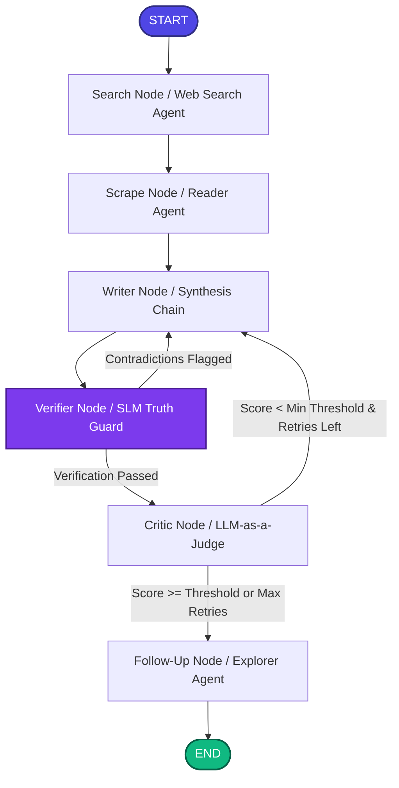

# Thoth: AI Research Copilot ✦

An autonomous, multi-agent academic research and synthesis workspace inspired by **SciSpace**, powered by **LangGraph**, **LangChain**, **NVIDIA AI Endpoints**, and **Streamlit**.

Thoth transforms natural language queries into comprehensive, verifiable research syntheses by querying live web registries, scraping academic sources, fact-checking claims with a dedicated 8B SLM **Truth Guard**, critiquing drafts with an **LLM-as-a-Judge**, and structuring findings into an interactive **Literature Review Matrix**.

---

## 📸 Interface Preview

### 1. Research Launchpad & Horizontal Agent Stepper


### 2. Split-Screen Copilot & Verified Synthesis Report


---

## 🏗️ Multi-Agent Architecture

Thoth implements a stateful looping graph using **LangGraph**:



### Specialized Agents & Nodes
1. **Search Agent (`search`)**: Targets relevant academic publications, policy documents, and data registries using Tavily.
2. **Reader Agent (`scrape`)**: Scrapes and extracts full text content from top URLs for grounded context.
3. **Writer Chain (`writer`)**: Drafts and iteratively refines structured research reports (Introduction, Key Findings, Knowledge Gaps, Methodology, Conclusion, Citations).
4. **Truth Guard Fact-Verifier (`verifier`)**: Uses **`meta/llama-3.1-8b-instruct`** on NVIDIA NIM with structured Pydantic schemas to verify claims against scraped source text in ~1–2s.
5. **Critic LLM-as-a-Judge (`critic`)**: Evaluates drafts across 5 dimensions (*Faithfulness, Relevance, Completeness, Evidence Quality, Clarity & Coherence*), enforcing quality thresholds.
6. **Follow-Up Explorer (`follow_up`)**: Generates targeted research questions to pivot into subsequent investigations.

---

## 🎨 Workspace Features (SciSpace-Inspired)

- **40 / 60 Split-Screen Layout**:
  - **Left Column (40%)**: Conversational Research Copilot with user message bubbles, agent responses, follow-up prompt chips, and a persistent query bar.
  - **Right Column (60%)**: Dedicated multi-tab Research Studio.
- **Horizontal Agent Planner Rail**: Pinned progress stepper showing live sub-tasks (`Search → Reader → Writer → Verifier → Critic → Follow-Up`) with animated pulses and per-node duration metrics.
- **Editorial Serif Prose (`Newsreader`)**: Synthesis reports rendered in editorial serif typography for superior academic readability.
- **Literature Review Matrix**: Multi-column comparative data table mapping *Source/Title*, *Key Contributions*, *Methodology*, and centered *Verification Status* badges.
- **Truth Guard Audit**: Live trace of claim validations and 5-dimension quality critique tables.
- **Research Scratchpad & Export**: Live note-taking drawer with one-click `.md` and `.txt` export capabilities.

---

## 📁 Repository Structure

```text
├── app.py                    # Streamlit split-screen research workspace
├── theme.py                  # Aurora Dark design tokens, Newsreader typography, & Stepper CSS
├── ui_adapter.py             # Thread-safe pipeline execution runner & state container
├── pipeline.py               # LangGraph state definitions, nodes, conditional routing logic
├── agents.py                 # Core agent chains & NVIDIA NIM SLM configurations
├── tools.py                  # Tavily search & BeautifulSoup reader tools
├── assets/                   # UI screenshots & visual assets
├── diagnostic_test.py        # Streaming execution & environment diagnostic utility
├── requirements.txt          # Python project dependencies
├── .env.example              # Template for API keys
└── .gitignore                # Git ignore configuration
```

---

## 🚀 Getting Started

### 1. Set Up Virtual Environment

```bash
# Clone the repository
git clone <your-repository-url>
cd thoth

# Create virtual environment
python3 -m venv venv

# Activate virtual environment
# On macOS / Linux:
source venv/bin/activate
# On Windows:
# venv\Scripts\activate
```

### 2. Install Dependencies

```bash
pip install --upgrade pip
pip install -r requirements.txt
```

### 3. Configure Environment Variables

Create a `.env` file from the `.env.example` template:

```bash
cp .env.example .env
```

Add your API keys to `.env`:
- **`NVIDIA_API_KEY`**: Obtain from the [NVIDIA API Catalog](https://build.nvidia.com).
- **`TAVILY_API_KEY`**: Obtain from [Tavily](https://tavily.com).

---

## 💻 Execution Commands

### A. Launch the Streamlit Research Workspace (Recommended)

```bash
streamlit run app.py
```
*(Or `./venv/bin/streamlit run app.py`)*

Open **`http://localhost:8501`** in your browser.

---

### B. Run CLI Headless Mode

```bash
python pipeline.py
```

---

### C. Run Diagnostics

Verify API keys, model connectivity, and token streaming:

```bash
python diagnostic_test.py
```
