<div align="center">


# THOTH · THE DIVINE SCRIBE
### Autonomous Multi-Agent Academic Research, Grounding & Synthesis Engine

[](https://www.python.org/downloads/)
[](https://github.com/langchain-ai/langgraph)
[](https://build.nvidia.com)
[](https://fastapi.tiangolo.com)
[-brightgreen.svg?style=for-the-badge)](tests/)
[](diagnostic_test.py)
[](LICENSE)

**Thoth** is an autonomous multi-agent research and intelligence synthesis system designed to discover, extract, cross-verify, and synthesize scientific literature into structured, publication-grade intelligence reports — streamed live to an interactive 3D web studio with bidirectional Obsidian vault synchronization.

<br/>


</div>

---

## 📖 Table of Contents

- [📜 The Mythos & Philosophy of Thoth](#-the-mythos--philosophy-of-thoth)
- [🏛️ Architecture & Data Flow Diagram](#️-comprehensive-architecture--data-flow-diagram)
- [⚡ Key Highlights & Core Capabilities](#-key-highlights--capabilities)
- [⚔️ Architectural Comparison Matrix](#️-architectural-comparison-matrix)
- [🧪 The Interactive Prompt Laboratory](#-the-interactive-prompt-laboratory)
- [🏛️ The Pantheon of Rigor (Adversarial Peer-Review Tribunal)](#-the-pantheon-of-rigor-preview)
- [📸 User Interface & 3D Research Studio](#-user-interface--3d-research-studio)
- [🕹️ Chatbot Modes & Latency Profile](#️-chatbot-modes--latency-profile)
- [🧩 The 8 Autonomous Agents Explained](#-the-8-autonomous-agents-explained)
- [⌨️ Power-User Keyboard Shortcuts](#️-power-user-keyboard-shortcuts)
- [🛠️ Concurrency, Resilience & Circuit Breaking](#️-concurrency-resilience--circuit-breaking)
- [🌐 REST API Reference](#-rest-api-reference)
- [🚀 Quickstart & Installation](#-quickstart--installation)
- [🧪 Verification & 12-Layer Diagnostics](#-verification--12-layer-diagnostics)
- [📂 Repository Structure](#-repository-structure)
- [🌟 Recent Enhancements](#-recent-enhancements)
- [📜 License](#-license)

---

## 📜 The Mythos & Philosophy of Thoth

> *"I am Thoth, the Lord of Divine Words, Master of the Balance, who measureth the heavens, counteth the stars, and weigheth the hearts against the Feather of Ma'at."*

In ancient Egyptian mythology, **Thoth** was the divine scribe, master of sciences, inventor of hieroglyphs, and the supreme judge of truth. While other gods ruled kingdoms, Thoth observed, recorded, calculated, and cross-examined reality.

In modern research, the web is flooded with low-signal summaries, hallucinated paper citations, and regurgitated academic jargon. **Thoth brings the ancient standard of Ma'at (uncompromising cosmic truth) to autonomous artificial intelligence:**
- **Zero Hallucinated Citations:** Every factual claim must be weighed against primary source text.
- **Deep Scientific Breadth:** Multi-hop scholarly traversal across arXiv, Semantic Scholar, PubMed, and Europe PMC.
- **Living Memory:** Real-time in-place Markdown report updating and persistent Obsidian vault integration.

---

## 🏛️ Comprehensive Architecture & Data Flow Diagram

The diagram below details every subsystem, network boundary, agent node, resilience barrier, conversational intake engine, and storage layer within Thoth.

```mermaid
%%{init: {'theme': 'dark', 'themeVariables': { 'fontSize': '12px', 'fontFamily': 'Inter, system-ui, -apple-system, BlinkMacSystemFont, sans-serif', 'darkMode': true, 'primaryColor': '#1e293b', 'primaryTextColor': '#f8fafc', 'primaryBorderColor': '#c99a6b', 'lineColor': '#94a3b8', 'secondaryColor': '#0f172a', 'tertiaryColor': '#1e293b'}}}%%

flowchart TB
    %% ─────────────────────────────────────────────────────────────
    %% 1. CLIENT / USER INTERACTION LAYER
    %% ─────────────────────────────────────────────────────────────
    subgraph CLIENT["1. Client Layer · Research Studio Frontend (web/)"]
        UI_HERO["Landing Hero Launcher<br/>• 3D Parallax Viewport<br/>• Preset Topic Matrix"]
        UI_REPL["Chat REPL & Proactive Pills<br/>• Auto-resize Input<br/>• Dynamic Send / Zap Button"]
        UI_MODE["Mode Selector Toggle<br/>• Fast Chat (Default)<br/>• Deep Research (8-Agent Swarm)<br/>• Web Probe | Vault QA | Expand"]
        UI_STEPPER["Active Pipeline Stepper<br/>• Visual Phase Badges<br/>• Cognitive Trace / CoT Accordion"]
        UI_PANES["Slide-in Living Artifacts<br/>• Living Markdown Report Pane<br/>• Scales of Ma'at Truth Audit<br/>• Interactive MindMap Graph<br/>• Source Bibliography & Vault Notes"]
        UI_PARSER["Resilient SSE Parser<br/>• CRLF (\\r\\n) Stream Normalizer<br/>• Non-blocking Chunk Dispatch"]
    end

    %% ─────────────────────────────────────────────────────────────
    %% 2. GATEWAY, ESCALATION & MANDATE LAYER
    %% ─────────────────────────────────────────────────────────────
    subgraph GATEWAY["2. Gateway, Escalation & Mandate Layer (backend/conversation/ · web_server.py)"]
        API_ROUTER{"POST /api/research/stream<br/>POST /api/followup/stream<br/>POST /api/conversation/escalate<br/>POST /api/research/clarify"}
        INTENT_ESCALATE{"3-State Escalation Engine<br/>detect_escalation_intent()<br/>CHAT ➔ CANDIDATE ➔ RESEARCH_READY"}
        MANDATE_SYNTH["Research Mandate Synthesizer<br/>synthesize_research_mandate()<br/>• Referential Pronoun Resolution<br/>• User Constraint & Hypothesis Extraction<br/>• Worker Noise Isolation"]
        CLARIFY_GATE{"Pre-Flight Clarification Gate<br/>evaluate_clarification_need()<br/>• Ambiguity Scoping Vectors<br/>• Inherited Context Bypass"}
        FAST_PATH["Fast Dialogue Handler<br/>• Model: Llama-3.1-8B-Instruct<br/>• Latency: < 500ms<br/>• Bypasses 8-Agent Swarm"]
        ASYNC_WORKER["Asyncio Queue Worker<br/>• ThreadPool Executor<br/>• sse_starlette EventSource<br/>• Non-blocking Telemetry Stream"]
    end

    %% ─────────────────────────────────────────────────────────────
    %% 3. RESILIENCE & CONCURRENCY DISPATCHER
    %% ─────────────────────────────────────────────────────────────
    subgraph DISPATCHER["3. Resilience & Concurrency Engine (backend/dispatcher.py)"]
        SEMAPHORE["Asyncio Semaphore<br/>max_concurrent = 3"]
        RATE_LIMIT["Rate-Limit Pacer<br/>Token Bucket / Interval Delays"]
        BACKOFF["Exponential Backoff<br/>Jitter + max_attempts = 4"]
        CIRCUIT["3-State Circuit Breaker<br/>CLOSED ➔ OPEN ➔ HALF-OPEN"]
    end

    %% ─────────────────────────────────────────────────────────────
    %% 4. AUTONOMOUS 8-AGENT RESEARCH SWARM
    %% ─────────────────────────────────────────────────────────────
    subgraph SWARM["4. Autonomous Research Swarm (backend/orchestrator.py · LangGraph StateGraph)"]
        direction TB

        subgraph RETRIEVAL["Phase I: Scholarly Discovery & Extraction"]
            NODE_SEARCH["1. Scholarly Search Node<br/>• arXiv API (Primary Physics/CS/Math)<br/>• Semantic Scholar S2 API<br/>• PubMed & Europe PMC API (Bio/Med)<br/>• Tavily AI Web Fallback"]
            NODE_SNOWBALL["1.5. Graph Snowballing Node<br/>• Forward Citation Expansion<br/>• Backward Reference Traversal<br/>• S2 Neural Recommendations"]
            NODE_SCRAPE["2. Reader Concurrent Scraper<br/>• Asyncio.gather Fan-out<br/>• BeautifulSoup DOM Cleaner<br/>• Structured Text Extractor"]
        end

        subgraph SYNTHESIS["Phase II: Generation & Dual Evaluation"]
            NODE_WRITER["3. Scribe / Writer Node<br/>• Model: Nemotron-70B / Nemotron-30B<br/>• Dynamic Token Budget Management<br/>• Structured Section Synthesis"]
            NODE_VERIFIER["4. Scales of Ma'at (Truth Guard)<br/>• Model: Llama-3.1-8B-Instruct<br/>• Claim-by-Claim Sentence Extraction<br/>• Source Ground-Truth Cross-Check"]
            NODE_CRITIC["5. Academic Critic Node<br/>• Model: Nemotron-70B / Nemotron-30B<br/>• 5-Axis Rubric Quality Scoring<br/>• Qualitative Remediation Directives"]
        end

        subgraph REPLAN["Phase III: Cyclic Self-Correction"]
            REPLAN_GATE{"Quality Gate<br/>Score ≥ 7.0 & No Hallucinations?"}
            CIRCULAR_CHECK["Circular Claim Detector<br/>detect_circular_replan()<br/>Prevents re-hallucinating claims"]
        end

        subgraph INDEXING["Phase IV: Knowledge Vault & Living Reports"]
            NODE_MINDMAP["6. Concept MindMap Generator<br/>• Hierarchical Graph Extraction<br/>• Nodes & Labeled Directed Edges"]
            NODE_VAULT["7. Obsidian Vault Indexer<br/>• Bidirectional [[wikilinks]]<br/>• Markdown Note Serialization<br/>• SQLite FTS & Vector Indexing"]
            NODE_PATCH["8. Living Report Patch Engine<br/>• Code-Fence-Aware Boundary Parser<br/>• In-Place Section Diffing & Replace<br/>• Markdown Structure Validation"]
        end
    end

    %% ─────────────────────────────────────────────────────────────
    %% 5. STORAGE & TELEMETRY LAYER
    %% ─────────────────────────────────────────────────────────────
    subgraph STORAGE["5. Storage, Memory & Telemetry (backend/memory/ · backend/reports/)"]
        VAULT_FS["Obsidian Vault Filesystem<br/>• vault/topics/*.md<br/>• vault/sources/*.md"]
        SQLITE_DB["Local SQLite DB (store.db)<br/>• notes, chunks, metadata<br/>• FTS5 Full-Text Search + Dense Vectors"]
        TELEMETRY["Deep Diagnostics & Telemetry<br/>• 12-Layer Continuous Diagnostic Suite<br/>• In-memory Tracing & Evaluation"]
    end

    %% ─────────────────────────────────────────────────────────────
    %% CONNECTORS & DATA FLOW
    %% ─────────────────────────────────────────────────────────────
    UI_HERO -->|Submit Topic| UI_PARSER
    UI_REPL -->|Send Message| UI_PARSER
    UI_MODE -->|Set Active Mode| UI_REPL
    UI_PARSER -->|HTTP POST JSON| API_ROUTER

    API_ROUTER --> INTENT_ESCALATE
    INTENT_ESCALATE -->|CHAT| FAST_PATH
    INTENT_ESCALATE -->|RESEARCH_CANDIDATE| UI_PARSER
    INTENT_ESCALATE -->|RESEARCH_READY| MANDATE_SYNTH

    MANDATE_SYNTH --> CLARIFY_GATE
    CLARIFY_GATE -->|Needs Clarification| UI_PARSER
    CLARIFY_GATE -->|Direct / Inherited Context| ASYNC_WORKER

    FAST_PATH -->|SSE Stream: direct_chat| UI_PARSER
    ASYNC_WORKER --> DISPATCHER
    DISPATCHER --> NODE_SEARCH

    NODE_SEARCH -->|Source Candidates| NODE_SNOWBALL
    NODE_SNOWBALL -->|Expanded Candidate Pool| NODE_SCRAPE
    NODE_SCRAPE -->|Scraped Clean Text| NODE_WRITER

    NODE_WRITER -->|Draft Synthesis Report| NODE_VERIFIER
    NODE_WRITER -->|Draft Synthesis Report| NODE_CRITIC

    NODE_VERIFIER -->|Verification Table| REPLAN_GATE
    NODE_CRITIC -->|Rubric Scores 0-10| REPLAN_GATE

    REPLAN_GATE -->|Score < 7.0 & Attempt < 2| CIRCULAR_CHECK
    CIRCULAR_CHECK -->|Feedback + Blocked Claims| NODE_WRITER

    REPLAN_GATE -->|Score ≥ 7.0 or Max Retries| NODE_MINDMAP
    NODE_MINDMAP -->|Graph Schema| NODE_VAULT
    NODE_VAULT --> NODE_PATCH

    NODE_PATCH --> VAULT_FS
    NODE_PATCH --> SQLITE_DB
    SWARM -.->|Diagnostic Spans| TELEMETRY

    ASYNC_WORKER -.->|SSE Events: search, snowball, scrape, writer, verifier, critic, complete| UI_PARSER
    UI_PARSER --> UI_STEPPER
    UI_PARSER --> UI_PANES
```



---

## ⚡ Key Highlights & Capabilities

### 1. Conversational Brainstorming to Deep Research Escalation (`backend/conversation/`)
Thoth enables users to explore ideas in conversational chat before seamlessly escalating into deep research swarms without restarting context:
- **3-State Escalation Engine**: Accurately distinguishes `CHAT` (technical explanations, meta-inquiries), `RESEARCH_CANDIDATE` (multi-turn evidence requests prompting for confirmation), and `RESEARCH_READY` (explicit research commands).
- **Semantic Research Mandate Synthesizer**: Distinguishes meta-commands (*"Can we investigate this properly using the literature?"*) from substantive research topics, resolving referential pronouns (*"this"*, *"that"*, *"the issue"*) back to prior turns, user-established facts, and hypotheses without leaking chat noise to workers.
- **Pre-Flight Clarification Gate**: Ambiguity detector that generates 2–3 concrete scoping vectors on broad queries (*"Batteries"*) while automatically bypassing clarification when technical specificity or constraints were already established in dialogue.

### 2. Multi-Provider Primary Source Retrieval & Citation Snowballing
Thoth searches primary academic repositories simultaneously without relying on proprietary search siloing:
- **arXiv API**: Direct metadata queries for physics, computer science, quantitative biology, and mathematics preprints.
- **Semantic Scholar API**: Academic citation counts, influential citations, and neural paper recommendations.
- **PubMed & Europe PMC API**: Biomedical, clinical trials, and life sciences research literature.
- **Tavily AI Search**: Live web fallback for recent technical announcements, whitepapers, and documentation.
- **Graph Citation Snowballing**: Expands search depth through forward citations, backward references, and neural paper embeddings.

### 3. Scales of Ma'at (Truth Guard Sentence-Level Verification)
Before any synthesis report is committed to the knowledge vault, the **Truth Guard SLM** extracts factual claims sentence-by-sentence and cross-references them against grounded source texts:
- Catches hallucinated statistics, fabricated author attributions, and unverified causal claims.
- Flags unverified assertions with structured rationale in a live audit table.
- Emits verification status per claim (`VERIFIED`, `PLAUSIBLE_INFERENCE`, `CONTRADICTED`, `UNSUPPORTED`).

### 4. LLM-as-a-Judge Quality Gating & Self-Correcting Replan Loop
The **Academic Critic** evaluates every draft across 5 orthogonal dimensions on a 0–10 scale:
1. **Faithfulness**: Are statements strictly grounded in retrieved primary sources?
2. **Relevance**: Does the synthesis directly address the core inquiry?
3. **Completeness**: Are all necessary sub-domains and methodology nuances covered?
4. **Evidence Quality**: Are high-impact primary sources cited rather than secondary summaries?
5. **Clarity & Coherence**: Is the prose publication-grade, formal, and logically organized?

> [!TIP]
> If the overall score is below **7.0/10**, Thoth initiates an **autonomous replan loop**, feeding the critic's remediation directives back to the Writer for an improved second attempt while running circular claim detection to prevent re-hallucinating rejected claims.

### 5. Living Report In-Place Diffing & Patching (`backend/reports/`)
- Allows targeted in-place updates to specific report sections (`REPORT_EXPANSION`) during follow-up interactions.
- **Code-Fence-Aware Boundary Parser**: Tracks Markdown code blocks to prevent Python/JS comments from being mistaken as document headings.
- **Structural Integrity Validation**: Ensures YAML frontmatter, neighboring sections, and existing citations (`[[src-id]]`) remain 100% intact.

### 6. Obsidian-Compatible Vault & Interactive Knowledge Graph
- Automatically serializes reports to `vault/topics/` and source notes to `vault/sources/` using bidirectional `[[wikilinks]]`.
- SQLite database (`store.db`) indexes full-text content with FTS5 search and 384-dimensional vector embeddings.
- Interactive front-end visualizers:
  - **Living Synthesis Report** (Markdown prose with real-time in-place patching)
  - **Scales of Ma'at Audit Table** (Claim verification statuses)
  - **Interactive MindMap Graph** (Concept nodes and relationship edges)
  - **Source Radar** (Full bibliography with external DOIs and URLs)

---

## ⚔️ Architectural Comparison Matrix

| Capability Dimension | Standard RAG / Perplexity | Generic Search Agents | **Thoth Autonomous Research Platform** |
| :--- | :--- | :--- | :--- |
| **Retrieval Architecture** | Single-hop top-k vector search | 2–3 linear search queries | **Multi-corpus scholarly API queries + S2 BFS citation snowballing** |
| **Context Window Capacity** | 4k–8k tokens | 8k tokens | **32,000 token synthesis budget with token budgeting** |
| **Fact-Checking & Grounding** | Best-effort LLM citation | Regex URL matching | ***Scales of Ma'at* sentence-level factual verification table** |
| **Quality Evaluation** | None (Single-pass generation) | None | **5-axis Academic Critic + Autonomous Replan loop** |
| **Conversational Escalation** | Rigid search input box | Disconnected chat & search | **3-state escalation (`CHAT` $\to$ `CANDIDATE` $\to$ `RESEARCH_READY`)** |
| **Mandate Context Filtering** | Dumps full chat into prompt | Dumps full chat into prompt | **Semantic Mandate Synthesizer with pronoun resolution** |
| **Artifact Mutation** | Static text responses | Generates new document | **In-place Living Report patching preserving frontmatter & citations** |
| **Knowledge Persistence** | Ephemeral browser session | Ephemeral cloud logs | **Local Obsidian Vault (`.md`) + SQLite FTS5 + Dense Vector Index** |

---

## 🧪 The Interactive Prompt Laboratory

Looking for something fascinating to investigate? Try copy-pasting these cutting-edge interdisciplinary prompts into Thoth:

<details>
<summary><b>🧬 1. CRISPR Prime Editing Off-Target Fidelity in Human T-Cells</b></summary>
<br/>

```text
Investigate recent 2024-2026 breakthroughs in pegRNA engineered modifications and engineered reverse transcriptases that minimize off-target insertions in human T-cell ex-vivo immunotherapies.
```
</details>

<details>
<summary><b>⚛️ 2. Surface Code Quantum Error Correction under Non-Markovian Noise</b></summary>
<br/>

```text
What are the empirical fault-tolerance threshold bounds for superconducting rotated surface codes when subjected to 1/f flux noise and correlated cosmic ray quasiparticle bursts?
```
</details>

<details>
<summary><b>🧠 3. Mechanistic Interpretability of Transformer Induction Heads</b></summary>
<br/>

```text
Analyze empirical evidence for how sparse autoencoders (SAEs) decompose the residual stream communication channels between induction heads and multi-query attention layers.
```
</details>

<details>
<summary><b>🔋 4. Solid-State LLZO Dendrite Suppression via ALD Nanocoatings</b></summary>
<br/>

```text
How do atomic layer deposition (ALD) Al2O3 and AlN ultrathin interlayers suppress lithium dendrite nucleation along grain boundaries in cubic garnet LLZO solid electrolytes?
```
</details>

<details>
<summary><b>🌌 5. Quantum Coherence in Avian Cryptochrome Magnetoreception</b></summary>
<br/>

```text
Examine radical pair mechanism kinetics and spin-correlated radical lifetime evidence in cryptochrome-4 (Cry4) under physiological avian body temperatures (40°C).
```
</details>

---

## 🏛️ The Pantheon of Rigor (Preview)

> [!NOTE]
> *Currently in development:* To ensure reports meet top-tier **Q1 Scopus, Nature, ACM, and IEEE** publication standards, Thoth is integrating an adversarial peer-review tribunal composed of history's greatest scientific minds:

```
┌────────────────────────────────────────────────────────────────────────────────────────┐
│                                THE PANTHEON OF RIGOR                                   │
├─────────────────────┬───────────────────────────┬──────────────────────────────────────┤
│ Peer Reviewer       │ Critical Lens             │ Signature Cross-Examination          │
├─────────────────────┼───────────────────────────┼──────────────────────────────────────┤
│ 1. Richard Feynman  │ First-Principles Razor    │ "Can you explain this without math   │
│                     │ Anti-Jargon Camouflage    │ camouflage and hollow buzzwords?"    │
├─────────────────────┼───────────────────────────┼──────────────────────────────────────┤
│ 2. Socrates         │ Elenctic Inquisitor       │ "What hidden axioms or circularity   │
│                     │ Assumption Destroyer      │ are you taking for granted as true?" │
├─────────────────────┼───────────────────────────┼──────────────────────────────────────┤
│ 3. Alan Turing      │ Computational Bounds      │ "Is this algorithmically tractable,  │
│                     │ Algorithmic Soundness     │ or does it merely displace the O(N)?"│
├─────────────────────┼───────────────────────────┼──────────────────────────────────────┤
│ 4. Albert Einstein  │ Paradigmatic Novelty      │ "How does this hypothesis hold under │
│                     │ Gedankenexperiments       │ extreme physical limit cases?"       │
├─────────────────────┼───────────────────────────┼──────────────────────────────────────┤
│ 5. Aristotle        │ Ontological Coherence     │ "Does this taxonomy violate domain   │
│                     │ Taxonomy Architecture     │ ontology and structural categories?" │
└─────────────────────┴───────────────────────────┴──────────────────────────────────────┘
```

---

## 📸 User Interface & 3D Research Studio

Thoth features a museum-grade, dark-mode research studio designed with `shadcn/ui` aesthetic tokens, glassmorphism surfaces, and 3D parallax effects driven by Anime.js.

### 1. Launchpad & Interactive 3D Hero Viewport
<div align="center">

</div>

- **3D Parallax Sculpture**: Dynamic perspective-shift viewport presenting Thoth, the Master of Ma'at.
- **Preset Academic Prompts**: One-click investigation chips across cutting-edge scientific disciplines (*Quantum Error Correction*, *CRISPR Prime Editing*, *Mechanistic Interpretability*, *Macroeconomic SFC Models*).
- **Core Reliability Metrics**: Instant visibility into agent counts, grounded fact audit rates, and sub-400ms FTS5 retrieval latency.

### 2. Tri-Pane Research Studio & Living Artifact Workspace
<div align="center">

</div>

| Studio Pane | Subsystem | Capabilities & Interactive Controls |
|:---|:---|:---|
| **Left Column** | **Obsidian Vault Explorer** | • Live filterable note index with FTS5 search<br/>• Direct inspection of `vault/topics/` and `vault/sources/`<br/>• Markdown modal preview with bidirectional `[[wikilinks]]` |
| **Center Column** | **Conversational REPL & Cognitive Trace** | • Fast Dialogue by default (<500ms response via `Llama-3.1-8B`)<br/>• Explicit **🔬 Deep Research** toggle button with pulsating active state<br/>• Dynamic action button (**`↑`** send for chat / **`⚡`** zap for deep research)<br/>• Real-time Agent Stepper Bar & expandable Cognitive Trace accordions<br/>• Proactive sub-topic recommendation pills |
| **Right Column** | **Living Artifact Inspector** | • **📄 Report Pane**: Live Markdown synthesis stream with in-place section updates<br/>• **⚖️ Scales of Ma'at**: Sentence-by-sentence truth verification audit table<br/>• **🧠 Mind Map**: Interactive concept relationship graph<br/>• **🔗 Sources**: Bibliography radar with direct DOI, arXiv, and web links |

---

## 🕹️ Chatbot Modes & Latency Profile

| Mode | Trigger | Engine / Model | Typical Latency | Best Used For |
|:---|:---|:---|:---|:---|
| **Chat** *(Default)* | Type in input bar | `Llama-3.1-8B-Instruct` | **< 500ms** | Casual conversation, high-level queries, guidance |
| **Deep Research** | Toggle 🔬 Button or Command | 8-Agent Swarm (`Nemotron-70B/30B` + `Llama-8B`) | **2–5 min** | Full academic literature discovery, fact-checked report |
| **Web Probe** | Select in Tool Menu | Tavily AI Search + `Llama-8B` | **~3–5s** | Real-time web lookups & breaking news |
| **Vault QA** | Select in Tool Menu | Local SQLite Index + `Llama-8B` | **~1–2s** | Querying across previously saved Obsidian notes |
| **Expand Report** | Select in Tool Menu | Living Report Patch Engine | **~15–30s** | In-place section replacement with new verified evidence |

---

## 🧩 The 8 Autonomous Agents Explained

```
┌────────────────────────────────────────────────────────────────────────────────────────┐
│                                   THOTH AGENT SWARM                                    │
├───────────────────┬───────────────────────────┬────────────────────────────────────────┤
│ Agent Name        │ Primary Model / Engine    │ Exact Role & Responsibility            │
├───────────────────┼───────────────────────────┼────────────────────────────────────────┤
│ 1. Searcher       │ Multi-API Scholarly Engine│ Queries arXiv, S2, PubMed, Europe PMC  │
│ 2. Snowballer     │ S2 Graph Traversal Engine │ Traverses citation & reference trees   │
│ 3. Reader         │ Concurrent Async Scraper  │ Extracts DOM text from candidate URLs  │
│ 4. Scribe         │ Nemotron-70B / 30B LLM    │ Synthesizes structured markdown report │
│ 5. Truth Guard    │ Llama-3.1-8B SLM          │ Validates claims against source ground │
│ 6. Critic         │ Nemotron-70B / 30B LLM    │ Scores 5-axis rubric (0-10)            │
│ 7. Cartographer   │ Structured Graph Parser   │ Generates concept MindMap graph schema │
│ 8. Vault Indexer  │ SQLite + Markdown Engine  │ Persists notes with [[wikilinks]]      │
└───────────────────┴───────────────────────────┴────────────────────────────────────────┘
```

---

## ⌨️ Power-User Keyboard Shortcuts

| Shortcut | Action | Scope |
|:---|:---|:---|
| <kbd>Enter</kbd> | Send casual message / prompt | Composer input |
| <kbd>Shift</kbd> + <kbd>Enter</kbd> | Insert newline | Composer input |
| <kbd>Cmd / Ctrl</kbd> + <kbd>Enter</kbd> | Launch Autonomous Deep Research Swarm | Composer input |
| <kbd>Cmd / Ctrl</kbd> + <kbd>K</kbd> | Focus & select composer input | Global |
| <kbd>Escape</kbd> | Close slide-in artifact modal / clear selection | Global |
| <kbd>1</kbd>–<kbd>4</kbd> | Switch Right Pane (Report / Truth / MindMap / Sources) | Living Workspace |

---

## 🛠️ Concurrency, Resilience & Circuit Breaking

Thoth incorporates a dedicated resilience layer (`backend/dispatcher.py`) preventing API lockouts and server crashes:
- **Asyncio Semaphore**: Capped at 3 concurrent out-of-process operations.
- **Rate-Limit Pacer**: Enforces minimum spacing between API calls to prevent 429 rate limit triggers.
- **Exponential Backoff with Jitter**: Automatically retries transient network failures up to 4 attempts.
- **3-State Circuit Breaker**: If 5 consecutive failures occur, trips to `OPEN` for 30s before testing recovery in `HALF-OPEN` state.
- **CRLF Stream Normalization**: The front-end parser automatically normalizes HTTP CRLF (`\r\n\r\n`) chunks to guarantee real-time SSE delivery.

---

## 🌐 REST API Reference

| Endpoint | Method | Payload / Params | Response / Stream Format | Description |
|:---|:---:|:---|:---|:---|
| `/api/research/stream` | `POST` | `{"topic": str, "mode": str, "history": []}` | `text/event-stream` (SSE) | Initiates autonomous research swarm pipeline or fast chat stream |
| `/api/followup/stream` | `POST` | `{"session_id": str, "query": str, "mode": str}` | `text/event-stream` (SSE) | Executes multi-turn follow-up turn (LOCAL_QA, WEB_SEARCH, REPORT_EXPANSION) |
| `/api/conversation/escalate` | `POST` | `{"query": str, "chat_turns": [], "summary": str}` | `application/json` | Analyzes dialogue and returns escalation state (`CHAT`, `CANDIDATE`, `READY`) |
| `/api/research/clarify` | `POST` | `{"topic": str, "constraints": []}` | `application/json` | Evaluates prompt ambiguity and generates 2–3 scoping vectors if broad |
| `/api/vault/notes` | `GET` | None | `application/json` | Returns all indexed Obsidian topics and source notes |
| `/api/vault/note/{path}` | `GET` | `path: str` | `application/json` | Retrieves raw Markdown and frontmatter of a specific note |
| `/api/vault/graph` | `GET` | None | `application/json` | Returns concept knowledge graph schema (`nodes`, `edges`) |

---

## 🚀 Quickstart & Installation

### 1. Prerequisites
- **Python 3.10+**
- Free **NVIDIA NIM API Key** (obtainable at [build.nvidia.com](https://build.nvidia.com))
- Optional: **Groq API Key** (for automatic multi-provider fallback)
- Optional: **Tavily API Key** (for live web search fallback)
- Optional: **Semantic Scholar API Key** (for higher S2 rate limits)

### 2. Clone & Virtual Environment Setup
```bash
git clone https://github.com/shayanazmi/Thoth.git
cd Thoth

python3 -m venv venv
source venv/bin/activate  # On Windows: venv\Scripts\activate

pip install -r requirements.txt
```

### 3. Environment Configuration
Create a `.env` file in the root directory (see [`.env.example`](.env.example)):
```ini
# Primary Inference Provider (NVIDIA NIM)
NVIDIA_API_KEY=nvapi-your-key-here

# Optional Fallback Inference Provider (Groq)
GROQ_API_KEY=gsk_your-groq-key-here

# Optional Scholarly & Web Search Keys
TAVILY_API_KEY=tvly-your-key-here
SEMANTIC_SCHOLAR_API_KEY=your-s2-key-here

# Storage & Vault Paths
THOTH_VAULT_DIR=./vault
THOTH_DB_PATH=./store.db
```

### 4. Launch Thoth Web Studio
```bash
./venv/bin/python run_web.py
```
The server will start at `http://127.0.0.1:8000` and automatically open your default browser.

---

## 🧪 Verification & 12-Layer Diagnostics

Thoth incorporates an extensive test suite and an autonomous 12-layer diagnostic system:

```bash
# 1. Full Pytest Regression Suite (224/224 tests passing in ~2.5m)
PYTHONPATH=. ./venv/bin/pytest tests/

# 2. Comprehensive 12-Layer System Diagnostic Suite
PYTHONPATH=. ./venv/bin/python diagnostic_test.py
```

### Diagnostic Layers Overview:
1. **Layer 1:** Environment & Primary LLM Connectivity Ping
2. **Layer 2:** Markdown Vault & SQLite Hybrid RRF Round-Trip
3. **Layer 3:** Dispatcher Concurrency, Rate Limiting & Circuit Breakers
4. **Layer 4:** Orchestrator Plan-Act-Observe-Replan Execution
5. **Layer 5:** Multi-Turn Conversational QA & Vault Persistence
6. **Layer 6:** Telemetry & Component Health Scorecard
7. **Layer 7:** AI Reviewer & Optimization Judge Verification
8. **Layer 8:** Conversational Escalation & 3-State Intent Classification
9. **Layer 9:** Research Mandate Synthesis & Referential Pronoun Resolution
10. **Layer 10:** Pre-Flight Clarification Gate & Scoping Vectors
11. **Layer 11:** Living Report Section Patching & Code-Fence Integrity
12. **Layer 12:** Protected Material (`handling api limit like feynman/`) & End-to-End Flow

---

## 📂 Repository Structure

```
thoth/
├── backend/
│   ├── conversation/         # Conversational escalation & mandate package
│   │   ├── escalation.py     # 3-state intent classifier (CHAT / CANDIDATE / READY)
│   │   ├── mandate.py        # Semantic mandate synthesizer & pronoun resolver
│   │   └── clarification.py  # Pre-flight ambiguity detector & scoping vectors
│   ├── reports/              # Living report mutation & patch package
│   │   ├── sections.py       # Code-fence-aware heading & boundary parser
│   │   ├── patch.py          # In-place section replacement & clean append fallback
│   │   └── validation.py     # Markdown structure & frontmatter validator
│   ├── agents.py             # LangGraph agent definitions (Writer, Verifier, Critic, MindMap)
│   ├── orchestrator.py       # Plan-Act-Observe-Replan StateGraph workflow
│   ├── pipeline.py           # Research pipeline & multi-turn follow-up runners
│   ├── scholarly.py          # Unified connectors (arXiv, S2, PubMed, Europe PMC, Tavily)
│   ├── dispatcher.py         # Concurrency semaphore, rate limiter & Circuit Breaker
│   ├── telemetry.py          # DeepEval local in-memory tracing integration
│   ├── tools.py              # BeautifulSoup DOM web scraping & text extraction tools
│   ├── memory/
│   │   ├── db.py             # SQLite persistence schema, queries & vector storage
│   │   ├── index.py          # Full-text search (FTS5) note indexing
│   │   ├── vault.py          # Obsidian Markdown file writer and reader
│   │   ├── graph.py          # Concept graph extraction and edge management
│   │   └── session.py        # Canonical token budgeting & sliding context memory
│   └── eval/                 # Evaluation suite (GEval metrics, datasets, runner)
├── web/
│   ├── index.html            # Museum-grade shadcn/ui dark mode Research Studio
│   ├── css/styles.css        # CSS design tokens, glassmorphism, animations
│   ├── js/
│   │   ├── app.js            # Frontend REPL, mode switching, SSE stream parser
│   │   └── animations.js     # Anime.js 3D parallax effects and micro-interactions
│   └── assets/               # Thoth museum sculptures, emblems, and visual assets
├── vault/
│   ├── topics/               # Generated Obsidian research reports (Git-ignored)
│   └── sources/              # Scraped source documentation notes (Git-ignored)
├── tests/                    # 26 Unit, integration & E2E test modules (224 tests)
├── diagnostic_test.py        # 12-layer continuous agentic diagnostic suite
├── web_server.py             # FastAPI backend with Server-Sent Events endpoints
├── run_web.py                # One-click launcher script
├── requirements.txt          # Python dependency specifications
├── .env.example              # Environment variables template
├── TODO.md                   # Detailed roadmap and tracked issues
└── README.md                 # Complete system documentation
```

---

## 🌟 Recent Enhancements

- **Conversational Brainstorming to Deep Research Escalation**: Seamless 3-state escalation model (`CHAT` $\to$ `RESEARCH_CANDIDATE` $\to$ `RESEARCH_READY`) with multi-turn hypothesis detection and bilingual triggers (*"ispar research karo"*, *"check the literature"*).
- **Semantic Research Mandate Synthesizer**: Distinguishes meta-commands from substantive research topics, resolving referential pronouns (*"this"*, *"that"*) to prior dialogue context while extracting constraints (date ranges, publication tiers) without leaking chat noise to workers.
- **Pre-Flight Clarification Gate**: Ambiguity detection engine providing 2–3 scoping options for broad topics while automatically bypassing clarification for specific or dialogue-constrained queries.
- **Living Report In-Place Section Updates**: In-place section replacement engine with code-fence-aware Markdown parsing, preserving YAML frontmatter, neighboring sections, and existing citations (`[[src-id]]`).
- **Comprehensive 12-Layer System Diagnostics & 224-Test Regression Suite**: Expanded diagnostic suite validating credentials, hybrid SQLite memory, circuit breakers, research FSM, escalation, mandates, clarification, report patching, and protected reference directories.

---

## 📜 License

Distributed under the **MIT License**. See `LICENSE` for more information.
