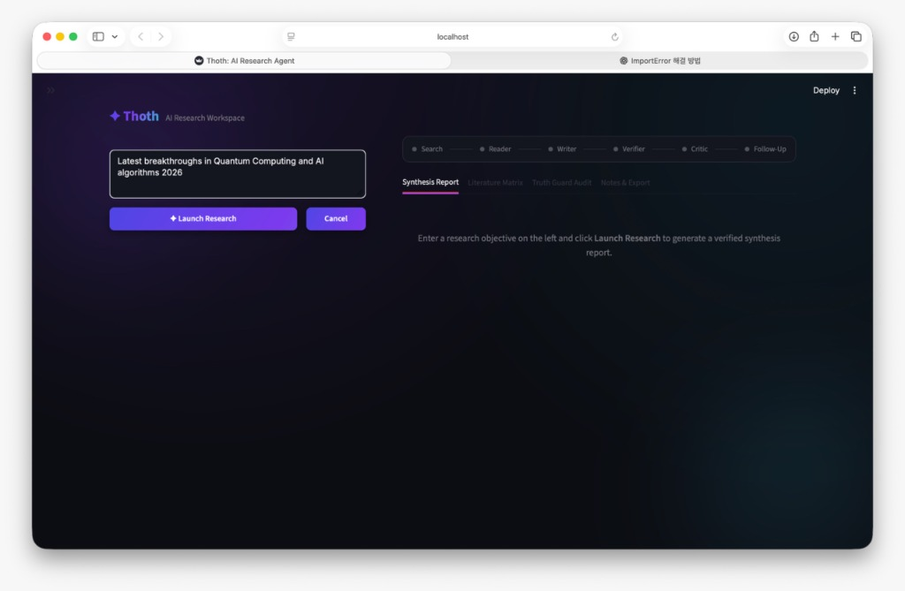
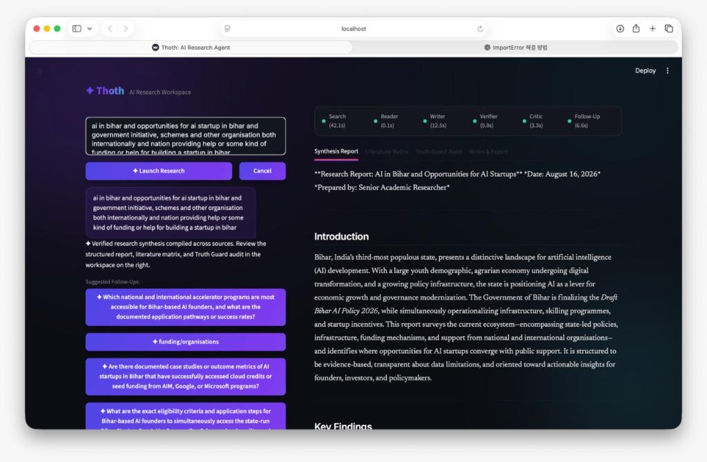
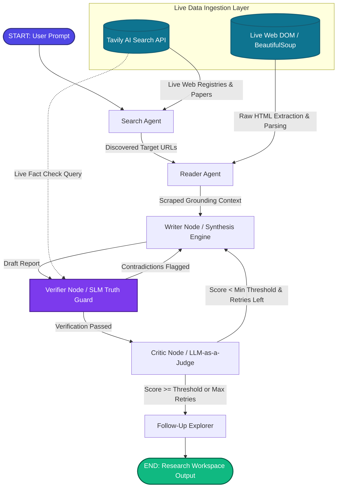

# Thoth: Agentic Research ✦

**Thoth** is an autonomous, multi-agent academic research and synthesis engine designed to systematically discover, extract, cross-verify, and synthesize complex scientific, technical, and policy literature into structured, evidence-backed research reports.

Traditional Large Language Model (LLM) generation often suffers from hallucinations, source conflations, and temporal knowledge cutoffs. Thoth mitigates these challenges by decoupling the research process into a **cyclic, self-correcting state graph** powered by **LangGraph**. The system orchestrates high-signal live web discovery, real-time DOM document parsing, schema-enforced Small Language Model (SLM) fact-verification (**Truth Guard**), and multi-dimensional **LLM-as-a-Judge** quality gating before presenting synthesized findings in an interactive research studio.

---

## 📸 Interface Preview

### 1. Research Launchpad & Horizontal Agent Stepper


### 2. Split-Screen Copilot & Verified Synthesis Report


---

## 🏗️ Multi-Agent Architecture & Data Pipeline

Thoth implements a deterministic, stateful looping graph using **LangGraph**, integrating real-time web retrieval, DOM scraping, and neural verification:



### Specialized Agents & Graph Nodes
1. **Search Agent (`search`)**: Interacts with the **Tavily AI Search API** using dynamic date-grounded query expansion to discover high-signal academic papers, institutional releases, and policy documentation.
2. **Reader Agent (`scrape`)**: Parses target URLs through an automated **BeautifulSoup DOM scraper**, stripping boilerplate/scripts to extract primary clean text for factual grounding.
3. **Synthesis Engine (`writer`)**: Drafts and iteratively refines comprehensive reports containing:
   - **Introduction**: Contextual overview and societal/technical significance.
   - **Key Findings**: Evidence-backed analytical pillars.
   - **Knowledge Gaps**: Open literature questions with actionable follow-up query strings.
   - **Methodology**: Research retrieval parameters and analytical bounds.
   - **Conclusion**: Key takeaways and actionable insights.
   - **Sources**: Non-fabricated, traceable source references.
4. **SLM Truth Guard (`verifier`)**: Employs **`meta/llama-3.1-8b-instruct`** on NVIDIA NIM with Pydantic structured output models to extract and test individual factual claims against source text (and live Tavily verification pings) in ~1–2 seconds. If conflations or contradictions are identified, the graph automatically loops back to the Writer node with explicit remediation instructions.
5. **Critic LLM-as-a-Judge (`critic`)**: Evaluates drafts across 5 orthogonal dimensions (*Faithfulness, Relevance, Completeness, Evidence Quality, Clarity & Coherence*), enforcing quality thresholds (default: ≥ 6.5/10) before authorizing publication.
6. **Follow-Up Explorer (`follow_up`)**: Generates targeted investigative threads to enable immediate pivot research.

---

## 🧠 100% Open-Weights & Open-Source AI Stack

Thoth is powered entirely by state-of-the-art open-weights models and open-source agent frameworks, guaranteeing transparency, data privacy control, and scientific reproducibility without lock-in to proprietary closed-source APIs:

| Component | Model / Technology | Architecture / Provider | License | Purpose |
|---|---|---|---|---|
| **Primary Synthesis LLM** | `nvidia/nemotron-3.5-lightning-30b-a3b` | NVIDIA Nemotron 30B MoE | Open Weights | Multi-source reasoning, long-form academic synthesis, and LLM-as-a-Judge quality critique. |
| **SLM Fact-Verifier (Truth Guard)** | `meta/llama-3.1-8b-instruct` | Meta Llama 3.1 8B | Llama 3.1 Community | Ultra-fast (~1–2s) structured Pydantic claim verification and contradiction detection. |
| **Agent State Machine** | `LangGraph` + `LangChain` | LangChain Framework | MIT License | Stateful cyclic graphs with conditional routing loops and runtime retry management. |
| **Document & Web Parsing** | `BeautifulSoup` + `Tavily` | Open Python Libraries | MIT / Apache 2.0 | Real-time DOM extraction, semantic filtering, and primary registry retrieval. |

---

## 🎨 Research Workspace Features

- **40 / 60 Split-Screen Workspace**:
  - **Left Column (40%)**: Conversational Research Copilot with chat history, follow-up prompt chips, and a persistent query input.
  - **Right Column (60%)**: Multi-tabbed research studio with sticky tab navigation.
- **Horizontal Agent Planner Rail**: Pinned progress stepper displaying real-time agent execution status (`Search → Reader → Writer → Verifier → Critic → Follow-Up`) with animated pulses and per-node duration tags.
- **Editorial Serif Prose (`Newsreader`)**: Long-form synthesis reports formatted in high-legibility serif typography with generous line-height (`1.78`).
- **Literature Review Matrix**: Interactive multi-column comparative data table mapping *Source/Title*, *Key Contributions*, *Methodology*, and centered *Verification Status* badges.
- **Truth Guard Audit Tab**: Full trace of claim validations, contradiction analyses, and the LLM-as-a-Judge critique scorecard.
- **Research Scratchpad & Export**: Integrated note-taking drawer supporting one-click `.md` and `.txt` exports.

---

## 📁 Repository Structure

```text
├── app.py                    # Streamlit split-screen research workspace
├── theme.py                  # Aurora Dark design tokens, Newsreader typography, & Stepper CSS
├── ui_adapter.py             # Thread-safe pipeline execution runner & state container
├── pipeline.py               # LangGraph state definitions, nodes, conditional routing logic
├── agents.py                 # Core agent chains & NVIDIA NIM SLM configurations
├── tools.py                  # Tavily search & BeautifulSoup reader tools
├── assets/                   # UI screenshots & visual assets
├── diagnostic_test.py        # Streaming execution & environment diagnostic utility
├── requirements.txt          # Python project dependencies
├── .env.example              # Template for API keys
└── .gitignore                # Git ignore configuration
```

---

## 🚀 Getting Started

### 1. Set Up Virtual Environment

```bash
# Clone the repository
git clone <your-repository-url>
cd thoth

# Create virtual environment
python3 -m venv venv

# Activate virtual environment
# On macOS / Linux:
source venv/bin/activate
# On Windows:
# venv\Scripts\activate
```

### 2. Install Dependencies

```bash
pip install --upgrade pip
pip install -r requirements.txt
```

### 3. Configure Environment Variables

Create a `.env` file from the `.env.example` template:

```bash
cp .env.example .env
```

Add your API keys to `.env`:
- **`NVIDIA_API_KEY`**: Obtain from the [NVIDIA API Catalog](https://build.nvidia.com).
- **`TAVILY_API_KEY`**: Obtain from [Tavily](https://tavily.com).

---

## 💻 Execution Commands

### A. Launch the Streamlit Research Workspace (Recommended)

```bash
streamlit run app.py
```
*(Or `./venv/bin/streamlit run app.py`)*

Open **`http://localhost:8501`** in your browser.

---

### B. Run CLI Headless Mode

```bash
python pipeline.py
```

---

### C. Run Deep 7-Layer Diagnostics (with GLM-5.2 AI Reviewer)

Verify credentials, tool scraping, SLM verification, graph pipeline, multi-turn QA, source tracking matrix, and run GLM-5.2 AI evaluation:

```bash
python diagnostic_test.py
```

---

## 🛠️ Advanced Features & Architecture

1. **Interactive Concept Mind Map (`vis.js`)**: Dynamic force-directed graph visualizing relationships between Topics, Sub-Themes, Findings, Sources, and Follow-Up Probes.
2. **Multi-Turn Follow-Up Explorer**: Support for `Context QA`, `Live Web Probe`, and `Living Report Expansion` with 1-click merging into the master synthesis report.
3. **Proactive Rolling Summarizer**: Keeps conversational context compact (< 3,500 tokens) for infinite multi-turn inquiry.
4. **GLM-5.2 AI Reviewer Suite**: Integrated 7-layer diagnostic suite evaluated live by `z-ai/glm-5.2` for architectural rigor.
