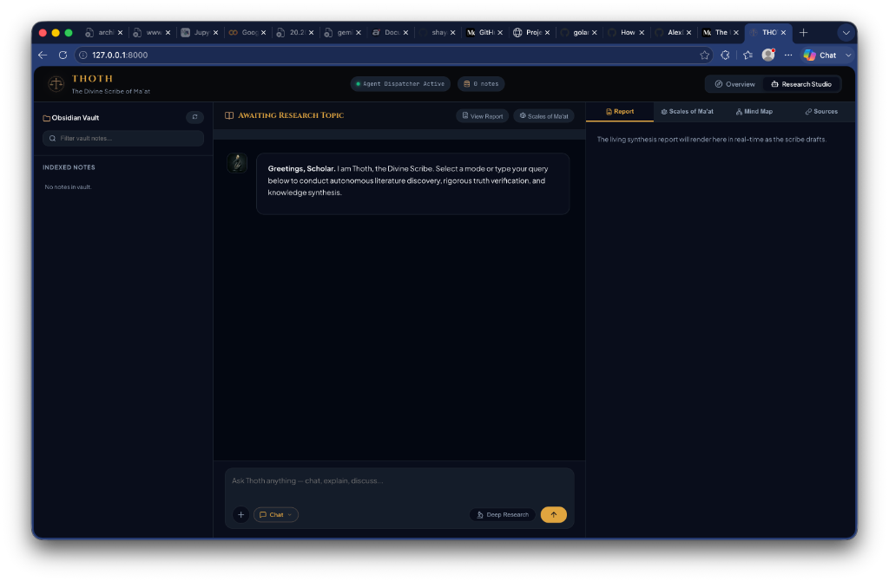
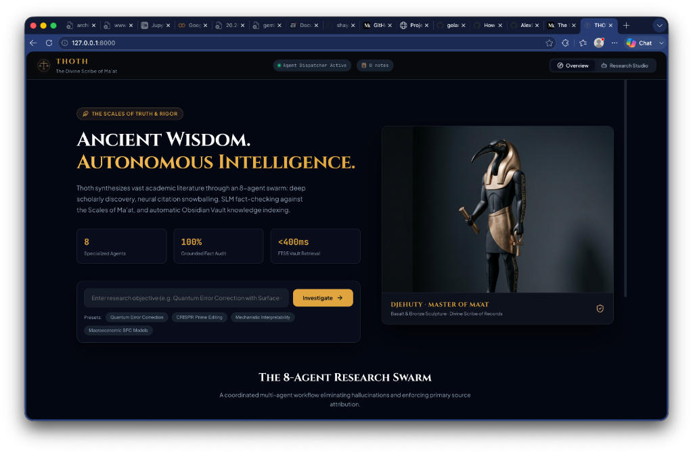

# Thoth · The Divine Scribe
### Autonomous Multi-Agent Academic Research & Synthesis Engine

<div align="center">

[](https://www.python.org/downloads/)
[](https://github.com/langchain-ai/langgraph)
[](https://build.nvidia.com)
[](https://fastapi.tiangolo.com)
[](LICENSE)

**Thoth** is an autonomous multi-agent research and synthesis engine designed to discover, extract, cross-verify, and synthesize scientific literature into structured, publication-grade intelligence reports — streamed live to a real-time 3D web studio.

</div>

---

## 🏛️ Comprehensive Architecture & Data Flow Diagram

The diagram below details every subsystem, network boundary, agent node, resilience barrier, and storage layer within Thoth.

```mermaid
%%{init: {'theme': 'dark', 'themeVariables': { 'fontSize': '12px', 'fontFamily': 'Inter, system-ui, -apple-system, BlinkMacSystemFont, sans-serif', 'darkMode': true, 'primaryColor': '#1e293b', 'primaryTextColor': '#f8fafc', 'primaryBorderColor': '#c99a6b', 'lineColor': '#94a3b8', 'secondaryColor': '#0f172a', 'tertiaryColor': '#1e293b'}}}%%

flowchart TB
    %% ─────────────────────────────────────────────────────────────
    %% 1. CLIENT / USER INTERACTION LAYER
    %% ─────────────────────────────────────────────────────────────
    subgraph CLIENT["1. Client Layer · Research Studio Frontend (web/)"]
        UI_HERO["Landing Hero Launcher<br/>• 3D Parallax Viewport<br/>• Preset Topic Matrix"]
        UI_REPL["Chat REPL & Proactive Pills<br/>• Auto-resize Input<br/>• Dynamic Send / Zap Button"]
        UI_MODE["Mode Selector Toggle<br/>• Fast Chat (Default)<br/>• Deep Research (8-Agent Swarm)<br/>• Web Probe | Vault QA | Expand"]
        UI_STEPPER["Active Pipeline Stepper<br/>• Visual Phase Badges<br/>• Cognitive Trace / CoT Accordion"]
        UI_PANES["Slide-in Living Artifacts<br/>• Markdown Report Pane<br/>• Scales of Ma'at Truth Audit<br/>• Interactive MindMap Graph<br/>• Source Bibliography & Vault Notes"]
        UI_PARSER["Resilient SSE Parser<br/>• CRLF (\\r\\n) Stream Normalizer<br/>• Non-blocking Chunk Dispatch"]
    end

    %% ─────────────────────────────────────────────────────────────
    %% 2. GATEWAY & INTENT ROUTING LAYER
    %% ─────────────────────────────────────────────────────────────
    subgraph GATEWAY["2. Gateway & Routing Layer (web_server.py / run_web.py)"]
        API_ROUTER{"POST /api/research/stream<br/>POST /api/followup/stream"}
        INTENT_CHECK{"Intent Guard<br/>is_casual_query()"}
        FAST_PATH["Fast Dialogue Handler<br/>• Model: Llama-3.1-8B-Instruct<br/>• Latency: < 500ms<br/>• Bypasses 8-Agent Swarm"]
        ASYNC_WORKER["Asyncio Queue Worker<br/>• ThreadPool Executor<br/>• sse_starlette EventSource<br/>• Non-blocking Telemetry Stream"]
    end

    %% ─────────────────────────────────────────────────────────────
    %% 3. RESILIENCE & CONCURRENCY DISPATCHER
    %% ─────────────────────────────────────────────────────────────
    subgraph DISPATCHER["3. Resilience & Concurrency Engine (backend/dispatcher.py)"]
        SEMAPHORE["Asyncio Semaphore<br/>max_concurrent = 3"]
        RATE_LIMIT["Rate-Limit Pacer<br/>Token Bucket / Interval Delays"]
        BACKOFF["Exponential Backoff<br/>Jitter + max_attempts = 4"]
        CIRCUIT["3-State Circuit Breaker<br/>CLOSED ➔ OPEN ➔ HALF-OPEN"]
    end

    %% ─────────────────────────────────────────────────────────────
    %% 4. AUTONOMOUS 8-AGENT RESEARCH SWARM
    %% ─────────────────────────────────────────────────────────────
    subgraph SWARM["4. Autonomous Research Swarm (backend/orchestrator.py · LangGraph StateGraph)"]
        direction TB

        subgraph RETRIEVAL["Phase I: Scholarly Discovery & Extraction"]
            NODE_SEARCH["1. Scholarly Search Node<br/>• arXiv API (Primary Physics/CS/Math)<br/>• Semantic Scholar S2 API<br/>• PubMed & Europe PMC API (Bio/Med)<br/>• Tavily AI Web Fallback"]
            NODE_SNOWBALL["1.5. Graph Snowballing Node<br/>• Forward Citation Expansion<br/>• Backward Reference Traversal<br/>• S2 Neural Recommendations"]
            NODE_SCRAPE["2. Reader Concurrent Scraper<br/>• Asyncio.gather Fan-out<br/>• BeautifulSoup DOM Cleaner<br/>• Structured Text Extractor"]
        end

        subgraph SYNTHESIS["Phase II: Generation & Dual Evaluation"]
            NODE_WRITER["3. Scribe / Writer Node<br/>• Model: Nemotron-70B / Nemotron-30B<br/>• Dynamic Token Budget Management<br/>• Structured Section Synthesis"]
            NODE_VERIFIER["4. Scales of Ma'at (Truth Guard)<br/>• Model: Llama-3.1-8B-Instruct<br/>• Claim-by-Claim Sentence Extraction<br/>• Source Ground-Truth Cross-Check"]
            NODE_CRITIC["5. Academic Critic Node<br/>• Model: Nemotron-70B / Nemotron-30B<br/>• 5-Axis Rubric Quality Scoring<br/>• Qualitative Remediation Directives"]
        end

        subgraph REPLAN["Phase III: Cyclic Self-Correction"]
            REPLAN_GATE{"Quality Gate<br/>Score ≥ 7.0 & No Hallucinations?"}
            CIRCULAR_CHECK["Circular Claim Detector<br/>detect_circular_replan()<br/>Prevents re-hallucinating claims"]
        end

        subgraph INDEXING["Phase IV: Knowledge Vault & Persistence"]
            NODE_MINDMAP["6. Concept MindMap Generator<br/>• Hierarchical Graph Extraction<br/>• Nodes & Labeled Directed Edges"]
            NODE_VAULT["7. Obsidian Vault Indexer<br/>• Bidirectional [[wikilinks]]<br/>• Markdown Note Serialization<br/>• SQLite FTS & Vector Indexing"]
        end
    end

    %% ─────────────────────────────────────────────────────────────
    %% 5. STORAGE & TELEMETRY LAYER
    %% ─────────────────────────────────────────────────────────────
    subgraph STORAGE["5. Storage & Telemetry (backend/memory/ · backend/telemetry.py)"]
        VAULT_FS["Obsidian Vault Filesystem<br/>• vault/topics/*.md<br/>• vault/sources/*.md"]
        SQLITE_DB["Local SQLite DB (store.db)<br/>• notes, chunks, metadata<br/>• FTS5 Full-Text Search"]
        TELEMETRY["DeepEval Local Telemetry<br/>• In-memory Tracing (EvalMode.ITERATOR_ASYNC)<br/>• Zero External API Keys Required"]
    end

    %% ─────────────────────────────────────────────────────────────
    %% CONNECTORS & DATA FLOW
    %% ─────────────────────────────────────────────────────────────
    UI_HERO -->|Submit Topic| UI_PARSER
    UI_REPL -->|Send Message| UI_PARSER
    UI_MODE -->|Set Active Mode| UI_REPL
    UI_PARSER -->|HTTP POST JSON| API_ROUTER

    API_ROUTER --> INTENT_CHECK
    INTENT_CHECK -->|Greeting / Casual / Fast Mode| FAST_PATH
    INTENT_CHECK -->|Deep Research Mode| ASYNC_WORKER

    FAST_PATH -->|SSE Stream: direct_chat| UI_PARSER
    ASYNC_WORKER --> DISPATCHER
    DISPATCHER --> NODE_SEARCH

    NODE_SEARCH -->|Source Candidates| NODE_SNOWBALL
    NODE_SNOWBALL -->|Expanded Candidate Pool| NODE_SCRAPE
    NODE_SCRAPE -->|Scraped Clean Text| NODE_WRITER

    NODE_WRITER -->|Draft Synthesis Report| NODE_VERIFIER
    NODE_WRITER -->|Draft Synthesis Report| NODE_CRITIC

    NODE_VERIFIER -->|Verification Table| REPLAN_GATE
    NODE_CRITIC -->|Rubric Scores 0-10| REPLAN_GATE

    REPLAN_GATE -->|Score < 7.0 & Attempt < 2| CIRCULAR_CHECK
    CIRCULAR_CHECK -->|Feedback + Blocked Claims| NODE_WRITER

    REPLAN_GATE -->|Score ≥ 7.0 or Max Retries| NODE_MINDMAP
    NODE_MINDMAP -->|Graph Schema| NODE_VAULT

    NODE_VAULT --> VAULT_FS
    NODE_VAULT --> SQLITE_DB
    SWARM -.->|Local Spans| TELEMETRY

    ASYNC_WORKER -.->|SSE Events: search, snowball, scrape, writer, verifier, critic, complete| UI_PARSER
    UI_PARSER --> UI_STEPPER
    UI_PARSER --> UI_PANES
```



---

## 📸 User Interface & 3D Research Studio

Thoth features a museum-grade, dark-mode research studio designed with `shadcn/ui` aesthetic tokens, glassmorphism surfaces, and 3D parallax effects driven by Anime.js.

### 1. Launchpad & Interactive 3D Hero Viewport

- **3D Parallax Sculpture**: Dynamic perspective-shift viewport presenting Thoth, the Master of Ma'at.
- **Preset Academic Prompts**: One-click investigation chips across cutting-edge scientific disciplines (*Quantum Error Correction*, *CRISPR Prime Editing*, *Mechanistic Interpretability*, *Macroeconomic SFC Models*).
- **Core Reliability Metrics**: Instant visibility into agent counts, grounded fact audit rates, and sub-400ms FTS5 retrieval latency.

### 2. Tri-Pane Research Studio & Living Artifact Workspace


| Studio Pane | Subsystem | Capabilities & Interactive Controls |
|-------------|-----------|-------------------------------------|
| **Left Column** | **Obsidian Vault Explorer** | • Live filterable note index with FTS5 search<br/>• Direct inspection of `vault/topics/` and `vault/sources/`<br/>• Markdown modal preview with bidirectional `[[wikilinks]]` |
| **Center Column** | **Conversational REPL & Cognitive Trace** | • Fast Dialogue by default (<500ms response via `Llama-3.1-8B`)<br/>• Explicit **🔬 Deep Research** toggle button with pulsating active state<br/>• Dynamic action button (**`↑`** send for chat / **`⚡`** zap for deep research)<br/>• Real-time Agent Stepper Bar & expandable Cognitive Trace accordions<br/>• Proactive sub-topic recommendation pills |
| **Right Column** | **Living Artifact Inspector** | • **📄 Report Pane**: Live Markdown synthesis stream as the scribe drafts<br/>• **⚖️ Scales of Ma'at**: Sentence-by-sentence truth verification audit table<br/>• **🧠 Mind Map**: Interactive concept relationship graph<br/>• **🔗 Sources**: Bibliography radar with direct DOI, arXiv, and web links |

---

## ⚡ Key Highlights & Capabilities

### 1. Dual-Path Interaction: Fast Dialogue vs. Deep Swarm
- **Fast Dialogue (Default)**: Normal greetings, meta-questions, and follow-up clarifications bypass the heavy 8-agent swarm and respond instantly via `Llama-3.1-8B-Instruct` in **under 500ms**.
- **Deep Research Swarm (Explicit Opt-In)**: Toggling the **Deep Research (🔬)** button triggers the full autonomous 8-agent LangGraph workflow for deep scientific discovery, rigorous cross-verification, and living report drafting.

### 2. Multi-Provider Primary Source Retrieval
Thoth searches primary academic repositories simultaneously without relying on proprietary search siloing:
- **arXiv API**: Direct metadata queries for physics, computer science, quantitative biology, and mathematics preprints.
- **Semantic Scholar API**: Academic citation counts, influential citations, and neural paper recommendations.
- **PubMed & Europe PMC API**: Biomedical, clinical trials, and life sciences research literature.
- **Tavily AI Search**: Live web fallback for recent technical announcements, whitepapers, and documentation.

### 3. Scales of Ma'at (Truth Guard Verification)
Before any synthesis report is committed to the knowledge vault, the **Truth Guard SLM** extracts factual claims sentence-by-sentence and cross-references them against grounded source texts.
- Catches hallucinated statistics, fabricated author attributions, and unverified causal claims.
- Flags unverified assertions with structured rationale.

### 4. LLM-as-a-Judge Quality Gating
The **Academic Critic** evaluates every draft across 5 orthogonal dimensions on a 0–10 scale:
1. **Faithfulness**: Are statements strictly grounded in the retrieved sources?
2. **Relevance**: Does the synthesis directly address the core inquiry?
3. **Completeness**: Are all necessary sub-domains and methodology nuances covered?
4. **Evidence Quality**: Are high-impact primary sources cited rather than secondary summaries?
5. **Clarity & Coherence**: Is the prose publication-grade, formal, and logically organized?

If the overall score is below **7.0/10**, Thoth initiates an **autonomous replan loop**, feeding the critic's remediation directives back to the Writer for an improved second attempt while running circular claim detection to prevent re-hallucinating rejected claims.

### 5. Obsidian-Compatible Vault & Interactive Artifacts
- Automatically serializes reports to `vault/topics/` and source notes to `vault/sources/` using bidirectional `[[wikilinks]]`.
- SQLite database (`store.db`) indexes full-text content with FTS5 search and citation metadata.
- Interactive front-end visualizers:
  - **Living Synthesis Report** (Markdown prose)
  - **Scales of Ma'at Audit Table** (Claim verification statuses)
  - **Interactive MindMap Graph** (Concept nodes and relationship edges)
  - **Source Radar** (Full bibliography with external DOIs and URLs)

---

## 🕹️ Chatbot Modes & Latency Profile

| Mode | Trigger | Engine / Model | Typical Latency | Best Used For |
|------|---------|----------------|-----------------|---------------|
| **Chat** *(Default)* | Type in input bar | `Llama-3.1-8B-Instruct` | **< 500ms** | Casual conversation, high-level queries, guidance |
| **Deep Research** | Toggle 🔬 Button | 8-Agent Swarm (`Nemotron-70B/30B` + `Llama-8B`) | **2–5 min** | Full academic literature discovery, fact-checked report |
| **Web Probe** | Select in Tool Menu | Tavily AI Search + `Llama-8B` | **~3–5s** | Real-time web lookups & breaking news |
| **Vault QA** | Select in Tool Menu | Local SQLite Index + `Llama-8B` | **~1–2s** | Querying across previously saved Obsidian notes |
| **Expand Report** | Select in Tool Menu | `Nemotron-70B/30B` Synthesis | **~15–30s** | Adding targeted deep-dive sections to existing report |

---

## 🧩 The 8 Autonomous Agents Explained

```
┌────────────────────────────────────────────────────────────────────────────────────────┐
│                                   THOTH AGENT SWARM                                    │
├───────────────────┬───────────────────────────┬────────────────────────────────────────┤
│ Agent Name        │ Primary Model / Engine    │ Exact Role & Responsibility            │
├───────────────────┼───────────────────────────┼────────────────────────────────────────┤
│ 1. Searcher       │ Multi-API Scholarly Engine│ Queries arXiv, S2, PubMed, Europe PMC  │
│ 2. Snowballer     │ S2 Graph Traversal Engine │ Traverses citation & reference trees   │
│ 3. Reader         │ Concurrent Async Scraper  │ Extracts DOM text from candidate URLs  │
│ 4. Scribe         │ Nemotron-70B / 30B LLM    │ Synthesizes structured markdown report │
│ 5. Truth Guard    │ Llama-3.1-8B SLM          │ Validates claims against source ground │
│ 6. Critic         │ Nemotron-70B / 30B LLM    │ Scores 5-axis rubric (0-10)            │
│ 7. Cartographer   │ Structured Graph Parser   │ Generates concept MindMap graph schema │
│ 8. Vault Indexer  │ SQLite + Markdown Engine  │ Persists notes with [[wikilinks]]      │
└───────────────────┴───────────────────────────┴────────────────────────────────────────┘
```

---

## 🛠️ Concurrency, Resilience & Circuit Breaking

Thoth incorporates a dedicated resilience layer (`backend/dispatcher.py`) preventing API lockouts and server crashes:
- **Asyncio Semaphore**: Capped at 3 concurrent out-of-process operations.
- **Rate-Limit Pacer**: Enforces minimum spacing between API calls to prevent 429 rate limit triggers.
- **Exponential Backoff with Jitter**: Automatically retries transient network failures up to 4 attempts.
- **3-State Circuit Breaker**: If 5 consecutive failures occur, trips to `OPEN` for 30s before testing recovery in `HALF-OPEN` state.
- **CRLF Stream Normalization**: The front-end parser automatically normalizes HTTP CRLF (`\r\n\r\n`) chunks to guarantee real-time SSE delivery.

---

## 🚀 Quickstart & Installation

### 1. Prerequisites
- **Python 3.10+**
- Free **NVIDIA NIM API Key** (obtainable at [build.nvidia.com](https://build.nvidia.com))
- Optional: **Groq API Key** (for automatic fallback)
- Optional: **Tavily API Key** (for live web search fallback)
- Optional: **Semantic Scholar API Key** (for higher rate limits)

### 2. Clone & Virtual Environment Setup
```bash
git clone https://github.com/shayanazmi/Thoth.git
cd Thoth

python3 -m venv venv
source venv/bin/activate  # On Windows: venv\Scripts\activate

pip install -r requirements.txt
```

### 3. Environment Configuration
Create a `.env` file in the root directory (see [`.env.example`](.env.example)):
```ini
# Primary Inference Provider (NVIDIA NIM)
NVIDIA_API_KEY=nvapi-your-key-here

# Optional Fallback Inference Provider (Groq)
GROQ_API_KEY=gsk_your-groq-key-here

# Optional Scholarly & Web Search Keys
TAVILY_API_KEY=tvly-your-key-here
SEMANTIC_SCHOLAR_API_KEY=your-s2-key-here

# Storage & Vault Paths
THOTH_VAULT_DIR=./vault
THOTH_DB_PATH=./store.db
```

### 4. Launch Thoth Web Studio
```bash
./venv/bin/python run_web.py
```
The server will start at `http://127.0.0.1:8000` and automatically open your default browser.

---

## 📂 Repository Structure

```
thoth/
├── backend/
│   ├── agents.py             # LangGraph agent definitions (Writer, Verifier, Critic, MindMap, etc.)
│   ├── orchestrator.py       # Plan-Act-Observe-Replan StateGraph workflow & concurrent fan-outs
│   ├── pipeline.py           # High-level research and multi-turn follow-up pipeline runners
│   ├── scholarly.py          # Unified search connectors (arXiv, S2, PubMed, Europe PMC, Tavily)
│   ├── dispatcher.py         # Concurrency semaphore, rate limiting, and Circuit Breaker
│   ├── telemetry.py          # DeepEval local in-memory tracing integration
│   ├── tools.py              # BeautifulSoup DOM web scraping & text extraction tools
│   ├── memory/
│   │   ├── db.py             # SQLite persistence schema, queries, and chunk storage
│   │   ├── index.py          # Full-text search (FTS) note indexing
│   │   ├── vault.py          # Obsidian Markdown file writer and reader
│   │   ├── graph.py          # Concept graph extraction and edge management
│   │   └── session.py        # Token budget and sliding context window memory
│   └── eval/                 # Evaluation suite (GEval metrics, datasets, runner)
│       ├── metrics.py        # 5-axis academic evaluation metrics
│       ├── judge_model.py    # LLM-as-a-judge model wrappers
│       ├── logical_integrity.py # Circular replan and factual integrity validation
│       ├── datasets.py       # Gold-standard academic test cases
│       └── runner.py         # Automated evaluation execution harness
├── web/
│   ├── index.html            # Museum-grade shadcn/ui dark mode Research Studio
│   ├── css/styles.css        # Comprehensive CSS design tokens, glassmorphism, animations
│   ├── js/
│   │   ├── app.js            # Frontend REPL, mode switching, SSE stream parser
│   │   └── animations.js     # Anime.js 3D parallax effects and micro-interactions
│   └── assets/               # Thoth museum sculptures, emblems, and visual assets
├── vault/
│   ├── topics/               # Generated Obsidian research reports (Git-ignored)
│   └── sources/              # Scraped source documentation notes (Git-ignored)
├── scripts/
│   ├── run_evals.py          # Script to run DeepEval evaluation suite
│   ├── run_multiturn_simulation.py # Script to simulate multi-turn research conversations
│   └── e2e_verification.py   # End-to-end integration test runner
├── tests/                    # Unit and integration test suite
├── web_server.py             # FastAPI backend with Server-Sent Events endpoints
├── run_web.py                # One-click launcher script
├── requirements.txt          # Python dependency specifications
├── .env.example              # Environment variables template
├── TODO.md                   # Detailed roadmap and tracked issues
└── README.md                 # Complete system documentation
```

---


## 📜 License

Distributed under the **MIT License**. See `LICENSE` for more information.
