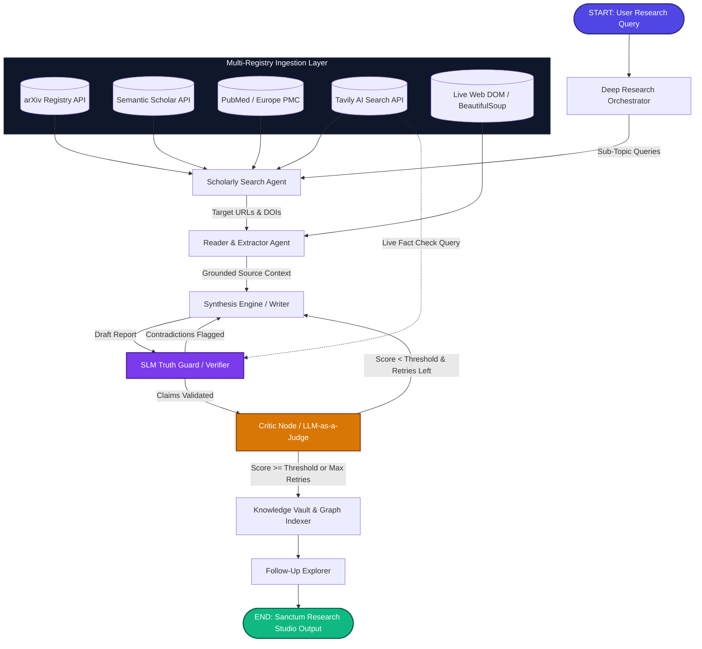

# Thoth: Autonomous Multi-Agent Academic Research & Synthesis Engine ✦

<div align="center">

[](https://www.python.org/downloads/)
[](https://github.com/langchain-ai/langgraph)
[](https://build.nvidia.com)
[](https://streamlit.io)
[](LICENSE)

**Thoth** is a state-of-the-art, autonomous multi-agent research and synthesis engine designed to systematically discover, extract, cross-verify, and synthesize complex scientific literature, technical documentation, and policy papers into structured, publication-grade intelligence reports.

</div>

---

## 📖 Table of Contents

- [The Problem & Vision](#-the-problem--vision)
- [Interface Preview](#-interface-preview)
- [Multi-Agent Architecture & Pipeline](#-multi-agent-architecture--pipeline)
- [Key Features & Capabilities](#-key-features--capabilities)
- [100% Open-Weights AI Stack](#-100-open-weights-ai-stack)
- [Repository Structure](#-repository-structure)
- [Getting Started](#-getting-started)
- [Running Thoth](#-running-thoth)
- [Diagnostics & Testing](#-diagnostics--testing)
- [Environment Configuration](#-environment-configuration)
- [License](#-license)

---

## 💡 The Problem & Vision

Traditional Large Language Model (LLM) generation often suffers from hallucinations, source conflations, and temporal knowledge cutoffs. Standard Retrieval-Augmented Generation (RAG) often performs shallow top-k vector chunk retrieval without verifying factual claims, evaluating methodology rigor, or tracing cross-domain connections.

**Thoth** resolves these challenges by decoupling the research process into a **deterministic, cyclic self-correcting state graph** powered by **LangGraph**:
1. **Live Scholarly Retrieval**: Discovers primary academic papers across arXiv, Semantic Scholar, PubMed / Europe PMC, and Tavily AI Search.
2. **Deterministic DOM Scraping**: Cleans and normalizes full-text web and paper bodies using resilient BeautifulSoup scrapers.
3. **Small Language Model (SLM) Truth Guard**: Employs fast structured claim extraction to test factual statements against grounded source texts before publication.
4. **LLM-as-a-Judge Quality Gating**: Evaluates drafts across 5 orthogonal academic dimensions (*Faithfulness, Relevance, Completeness, Evidence Quality, Clarity*).
5. **Obsidian-Compatible Knowledge Vault**: Automatically compiles bidirectional `[[wikilinks]]`, persistent SQLite metadata, and an interactive force-directed knowledge graph.

---

## 📸 Interface Preview

### 1. Research Launchpad & Horizontal Agent Stepper


### 2. Split-Screen Copilot & Verified Synthesis Report


---

## 🏗️ Multi-Agent Architecture & Pipeline

Thoth implements a stateful cyclic graph with conditional feedback routing:



### Specialized Agents & Modules

- **Deep Research Orchestrator (`backend/orchestrator.py`)**: Decomposes complex inquiries into sub-topics, executes parallel multi-registry sweeps, reconciles cross-topic findings, and synchronizes state transitions.
- **Scholarly Retrieval Engine (`backend/scholarly.py`)**: Interacts with arXiv, Semantic Scholar, PubMed / Europe PMC, and Tavily with automatic DOI resolution and BibTeX citation formatting.
- **Reader Agent (`backend/tools.py`)**: Strips boilerplate scripts and navigates DOM structures to extract primary grounding context.
- **Synthesis Engine (`backend/agents.py`)**: Drafts and refines comprehensive academic reports featuring *Executive Summary, Analytical Pillars, Methodological Bounds, Knowledge Gaps, and Traceable Citations*.
- **SLM Truth Guard (`backend/agents.py`)**: Leverages `meta/llama-3.1-8b-instruct` on NVIDIA NIM with Pydantic structured schemas to validate claims in ~1–2 seconds.
- **Critic LLM-as-a-Judge (`backend/agents.py`)**: Evaluates drafts using a strict 5-dimensional rubric, enforcing threshold scores (default: ≥ 6.5/10) before authorizing publication.
- **Resilient LLM Dispatcher (`backend/dispatcher.py`)**: Manages model routing, rate limits, exponential backoff, and graceful failovers across NVIDIA NIM, OpenAI, and Groq.
- **Knowledge Vault & Memory System (`backend/memory/`)**: Persistent SQLite storage (`store.db`), Obsidian-compatible markdown notes (`vault/`), and hybrid vector/keyword search index.

---

## 🌟 Key Features & Capabilities

- **40 / 60 Split-Screen Workspace (Sanctum)**:
  - **Left Copilot (40%)**: Multi-turn conversational research partner with persistent chat history, suggested investigation chips, and rolling context summarization (< 3,500 tokens).
  - **Right Studio (60%)**: Multi-tabbed research suite with sticky tab navigation.
- **Horizontal Agent Planner Rail**: Pinned progress stepper displaying live agent execution (`Search → Reader → Writer → Verifier → Critic → Follow-Up`) with animated pulses and per-node duration tags.
- **Editorial Serif Typography (`Newsreader`)**: Long-form synthesis reports rendered in high-legibility serif prose with optimal line-height (`1.78`).
- **Interactive Knowledge Codex (`vis.js`)**: Force-directed relational graph visualizing connections between Topics, Sub-Themes, Entities, Sources, and Follow-Up Probes.
- **Literature Review Matrix (Atelier)**: Comparative cross-source matrix mapping *Source/Title*, *Key Contributions*, *Methodology*, and centered *Verification Badges*.
- **Truth Guard Audit Drawer**: Detailed audit log of validated claims, flagged contradictions, and the LLM-as-a-Judge critique scorecard.
- **Multi-Format Export**: One-click exports to `.md`, `.json`, and `.txt` with complete metadata and formatted references.

---

## 🧠 100% Open-Weights AI Stack

Thoth is built primarily on state-of-the-art open-weights models and open-source agent frameworks:

| Component | Model / Technology | Provider / Framework | Purpose |
|---|---|---|---|
| **Primary Synthesis LLM** | `nvidia/nemotron-3.5-lightning-30b-a3b` | NVIDIA NIM | Deep multi-source reasoning, long-form synthesis, and LLM-as-a-Judge critique. |
| **SLM Fact-Verifier (Truth Guard)** | `meta/llama-3.1-8b-instruct` | NVIDIA NIM / Meta | High-speed (~1–2s) structured Pydantic claim verification and contradiction testing. |
| **Agent Orchestration** | `LangGraph` + `LangChain` | LangChain | Stateful cyclic graphs with conditional routing loops and runtime retry management. |
| **Scholarly Registries** | `arXiv` · `Semantic Scholar` · `PubMed` · `Tavily` | Open APIs / Tavily | Real-time academic paper discovery, DOI resolution, and web grounding. |
| **Knowledge Vault & Graph** | `SQLite` + `vis.js` + `SentenceTransformers` | Open Source | Bidirectional Markdown vault, vector search indexing, and graph visualization. |

---

## 📁 Repository Structure

```text
thoth/
├── backend/                  # Multi-agent graph engine, memory, & scholarly tools
│   ├── __init__.py           # Backend package exports
│   ├── agents.py             # LLM agent definitions, prompts, & structured chains
│   ├── dispatcher.py         # Multi-provider LLM routing & rate-limit failover
│   ├── orchestrator.py       # DeepResearchOrchestrator multi-subtopic planner
│   ├── pipeline.py           # LangGraph state machine & streaming orchestration
│   ├── scholarly.py          # Academic engine (arXiv, Semantic Scholar, PubMed, BibTeX)
│   ├── tools.py              # Web scraping & Tavily search tools
│   └── memory/               # Persistent memory & Obsidian Knowledge Vault
│       ├── __init__.py       # Memory package exports
│       ├── db.py             # SQLite database layer (store.db)
│       ├── graph.py          # Entity co-occurrence & knowledge graph builder
│       ├── index.py          # Local vector & hybrid search index
│       ├── session.py        # Multi-session memory management
│       └── vault.py          # Obsidian-compatible Markdown vault with wikilinks
├── frontend/                 # Streamlit Sanctum UI & styling system
│   ├── __init__.py           # Frontend package exports
│   ├── app.py                # Streamlit multi-view router & session state
│   ├── theme.py              # Obsidian glassmorphism CSS & design tokens
│   ├── ui_adapter.py         # Thread-safe pipeline execution bridge & event bus
│   └── views.py              # Sanctum, Codex, Atelier, Chrono, and Settings views
├── assets/                   # UI screenshots & visual assets
├── scripts/                  # Verification & utility scripts
│   └── e2e_verification.py   # Headless end-to-end integration test script
├── tests/                    # Comprehensive unit and integration test suite
│   ├── test_concurrent_orchestrator.py
│   ├── test_critic.py
│   ├── test_dispatcher.py
│   ├── test_graph.py
│   ├── test_memory_vault.py
│   ├── test_orchestrator.py
│   ├── test_resilience.py
│   ├── test_scholarly.py
│   ├── test_session_memory.py
│   ├── test_token_budget.py
│   └── test_verifier.py
├── app.py                    # Root Streamlit launcher
├── diagnostic_test.py        # 7-Layer Deep Agentic Diagnostic Suite
├── requirements.txt          # Python project dependencies
├── .env.example              # Template for API keys
├── .gitignore                # Git ignore rules
└── README.md                 # Project documentation
```

---

## 🚀 Getting Started

### 1. Prerequisites

- Python 3.10 or higher
- Git

### 2. Clone and Setup Environment

```bash
# Clone the repository
git clone <your-repository-url>
cd thoth

# Create a virtual environment
python3 -m venv venv

# Activate the virtual environment
# On macOS / Linux:
source venv/bin/activate
# On Windows:
# venv\Scripts\activate
```

### 3. Install Dependencies

```bash
pip install --upgrade pip
pip install -r requirements.txt
```

### 4. Configure Environment Variables

Create a `.env` file from the `.env.example` template:

```bash
cp .env.example .env
```

Open `.env` and add your API keys:
- **`TAVILY_API_KEY`**: Obtain from [Tavily](https://tavily.com).
- **`NVIDIA_API_KEY`**: Obtain from [NVIDIA Build](https://build.nvidia.com).
- **`OPENAI_API_KEY`** *(Optional)*: Secondary fallback provider.
- **`GROQ_API_KEY`** *(Optional)*: Low-latency inference fallback.

---

## 💻 Running Thoth

### A. Launch the Streamlit Research Sanctum (Recommended)

```bash
streamlit run app.py
```

Open **`http://localhost:8501`** in your browser to access the interactive research studio.

---

### B. Run Headless CLI Pipeline

Execute the autonomous multi-agent pipeline directly from the command line:

```bash
python -m backend.pipeline
```

---

### C. Run End-to-End Headless Verification

```bash
python scripts/e2e_verification.py
```

---

## 🧪 Diagnostics & Testing

### 1. 7-Layer Deep Agentic Diagnostic Suite

Thoth includes a built-in diagnostic test suite that validates credentials, web scraping, SLM verification, graph pipeline loops, multi-turn QA, source tracking matrix, and automated evaluation:

```bash
python diagnostic_test.py
```

### 2. Run Pytest Test Suite

Execute the comprehensive test suite across all 11 test modules:

```bash
pytest tests/ -v
```

---

## ⚙️ Environment Configuration

| Variable | Required | Description |
|---|---|---|
| `TAVILY_API_KEY` | **Yes** | Live web search & real-time fact-checking API key. |
| `NVIDIA_API_KEY` | **Yes** | Access to NVIDIA NIM endpoints (`nemotron-30b`, `llama-3.1-8b`). |
| `OPENAI_API_KEY` | *Optional* | Fallback LLM provider for `LLMDispatcher`. |
| `GROQ_API_KEY` | *Optional* | High-speed open-weights inference fallback. |

---

## 📄 License

This project is licensed under the **MIT License**. See the [LICENSE](LICENSE) file for details.
